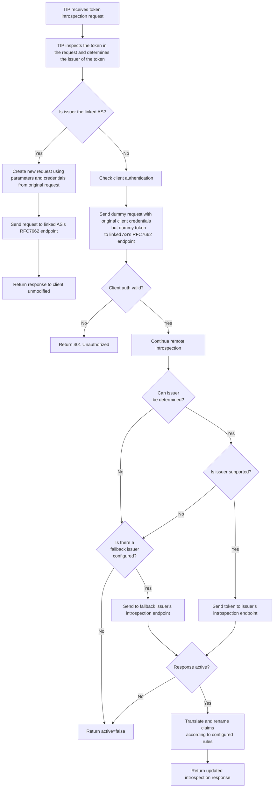

# TIP - Token Introspection Proxy

Remote Token Introspection is just a TIP away.

TIP implements [AARC G052](https://aarc-community.org/guidelines/aarc-g052/). The focus of TIP is to enable OpenID 
Providers and OAuth Authorisation Servers that already implement a native token introspection endpoint per
[RFC7662](https://datatracker.ietf.org/doc/html/rfc7662) to support
[AARC G052](https://aarc-community.org/guidelines/aarc-g052/) without the need of additional implementations.

## How to TIP?

## How to deploy TIP

- TIP is deployed close to the existing AS.
- The existing [RFC7662](https://datatracker.ietf.org/doc/html/rfc7662) introspection endpoint is removed from the 
  metadata discovery.
- The introspection endpoint provided by TIP is added as `introspection_endpoint` to the metadata discovery.

## What does TIP do?

## Configuration
For an example configuration (including comments) please see [example-config.yaml](example-config.yaml).

## Docker Image
The docker image [myoidc/tip](https://hub.docker.com/r/myoidc/tip) is available at
[dockerhub](https://hub.docker.com/r/myoidc/tip).

## Future Work

- Support for OpenID Federation will be added. Then it is not required to register a client with remote issuers (as 
  long as they are part of the same federation).
- ...